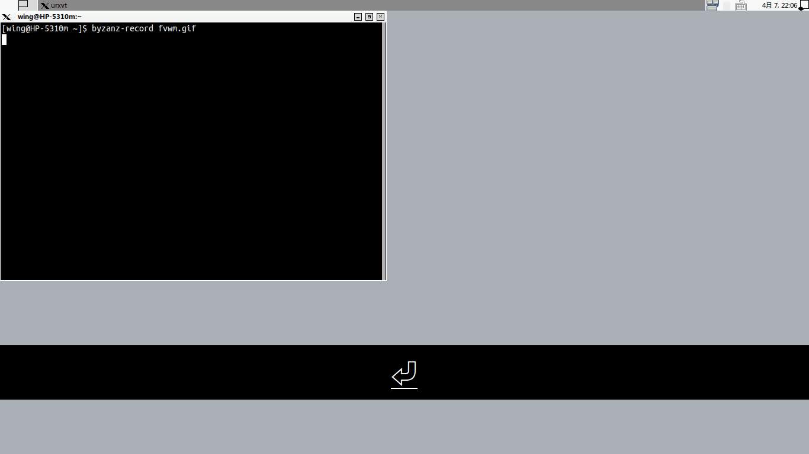

fvwm窗口管理器功能很强大，Robert Ulbricht将fvwm打造成平铺式窗口管理器，下面是功能的简单介绍。

Robert Ulbricht的[配置文件](https://github.com/urob/fvwm-tiling.git)已经是五年没有更新过了，如果直接使用它的配置文件，会有窗口位置计算错误的bug。
我对它的配置文件主要做了如下修改：
- 修正了窗口位置计算错误
- 修改部分快捷键

以下是简单的使用说明：
    States used
    -----------

State 0: Toggles EdgeScroll (true if EdgeThickness 0), only applies to
         FvwmButtons
State 1: true if window is master
State 2: true if window is floating
State 3: toggles Title/!Title (true if !Title)

E.g., to configure mplayer to always be floating just add 'Style "MPlayer"
State 2' to the configuration. (To set a window to be floating on the fly just
use the keyboard shortcut, see below.) Otherwise the states are handled
automatically in the background by the functions of this configuration.

    Requirements
    ------------

The use of 'urxvt' is hardcoded as the default shell. Sorry! Either
install or better change code (using a variable). Further the background
console relies on 'screen'. Finally, 'stalonetray' is used as tray and
'dmenu_path' is used for the program launcher. Install or adjust. (A
recompiled-version of dmenu to match the taskbar-size is included, you
may have to compile yourself if running on another platform.)

    Customization
    -------------

By default I use a 2x2x1 desktop configuration. I.e., I have 2 desks a 2x1
pages. By default only the left page of desk 0 (the default desk) starts in
tiling mode (can be toggled on the fly or changed permanently in the
configuration).

There are a number of color themes to chose from in the theme folder,
which can be easily switched in the configuration file.

The background console launches a screen session which reads the configuration
file screenrc.bgc.

Almost all of the customization is done in the main configuration file.
Just read through it. If you use vim, the folding should make it rather
organized and easy to read.

    Keybindings
    -----------

Tiling-Related:
 Super+Space:       Switch current page between floating/tiling mode
                  (can also be done using the indicator-button in the
                  right upper corner of the button bar).
 Super+Shift+Space: Switch current window between floating/tiling 
                  (only applies when in tiling mode)
 Ctrl+Alt+Enter:  Make current window master
 Alt+L:           Increase master area
 Alt+H:           Decrease master area

Selecting windows:
 Super+J:           Select next window clockwise
 Super+K:           Select next window counterclockwise
 Alt+Ctrl+J:      Move current window clockwise
 Alt+Ctrl+K:      Move current window counterclockwise
 Alt+Tab:         Cycle through complete window list (including minimized and
                  windows on other pages)

Navigating workspaces:
 Alt-Right:       Go to right page (alternative binding: Alt+])
 Alt-Left:        Go to left page (alternative binding: Alt+[)
 Alt-Ctrl-Right:  Go to right page and take focused windows with you
 Alt-Ctrl-Left:   Go to left page and take focused windows with you
 Alt-Down:        Go to next (secondary) desk
 Alt-Up:          Go to previous (primary) desk
 Alt-Escape:      Go to last page

Window operations:
 Super+M:           Maximize window and set to floating
 Super+T:           Titlebar on/off
 Super+S:           Toggle Sticky
 Super+X:           Minimize (retrieve using the taskbar or Alt+Tab)
 Alt+Shift+C:     Close (alternative shortcut Alt+F4)
 Alt+LeftClick:   Move window and set to floating
 Alt+RightClick:  Resize window and set to floating

Other:
 Super+P:           Execute command (launches dmenu)
 Alt+Grave:       Toggle Background console
 Middle-Click root window/titlebar: Toggle Edgescrolling

Applications:
 Various, customize in the keybinding section of the configuration file
